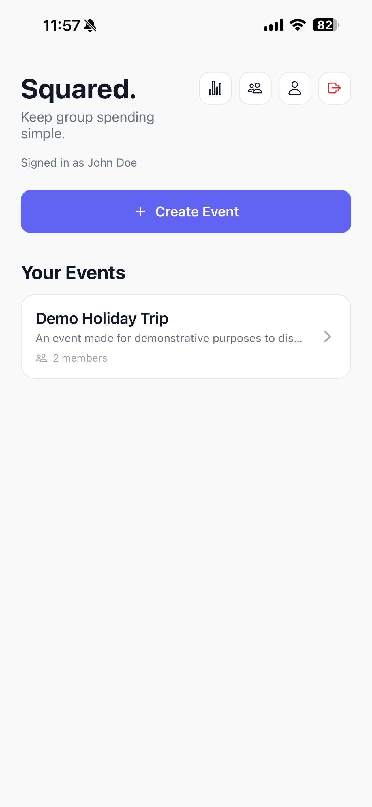
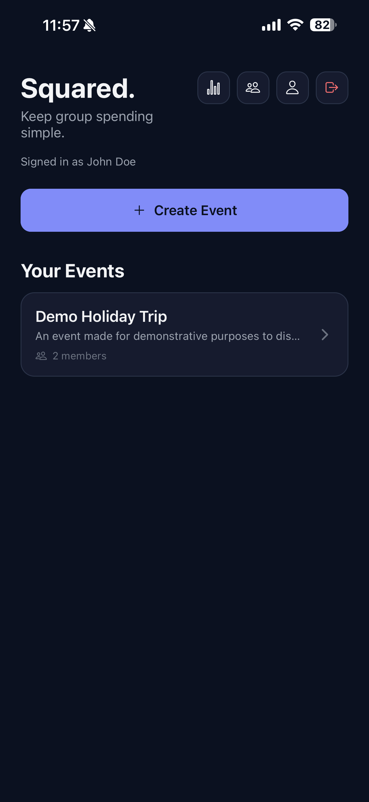
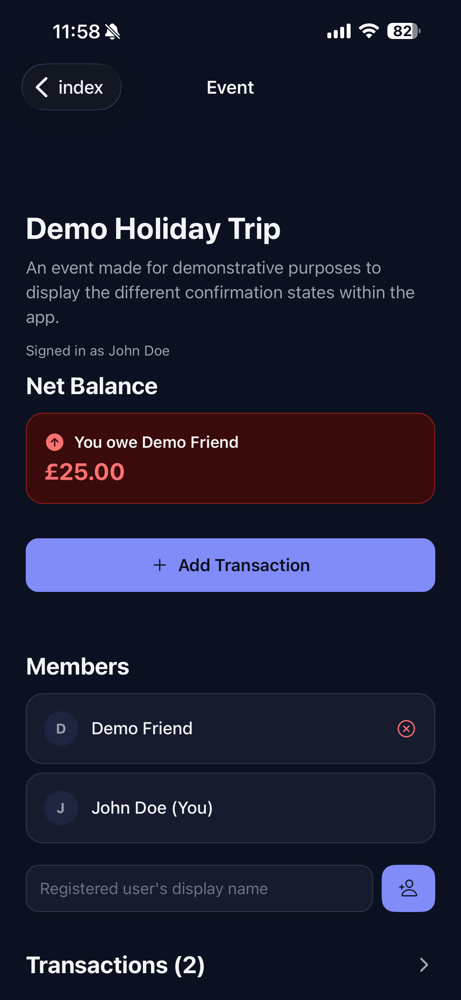
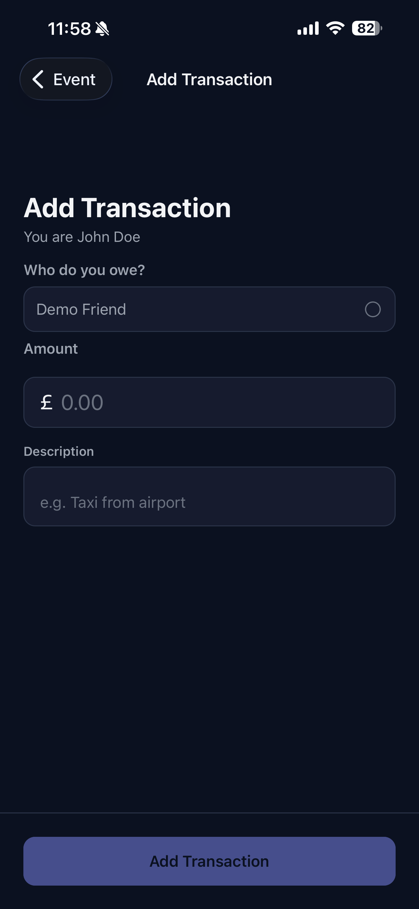
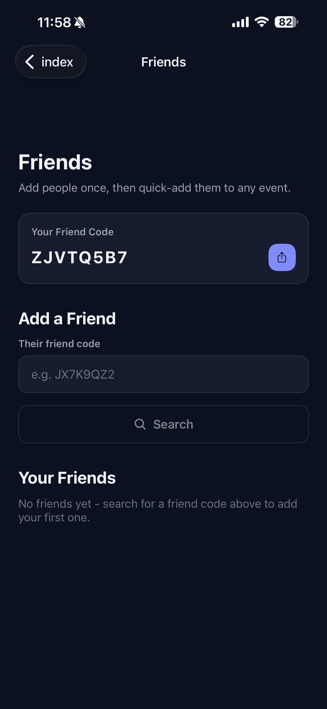
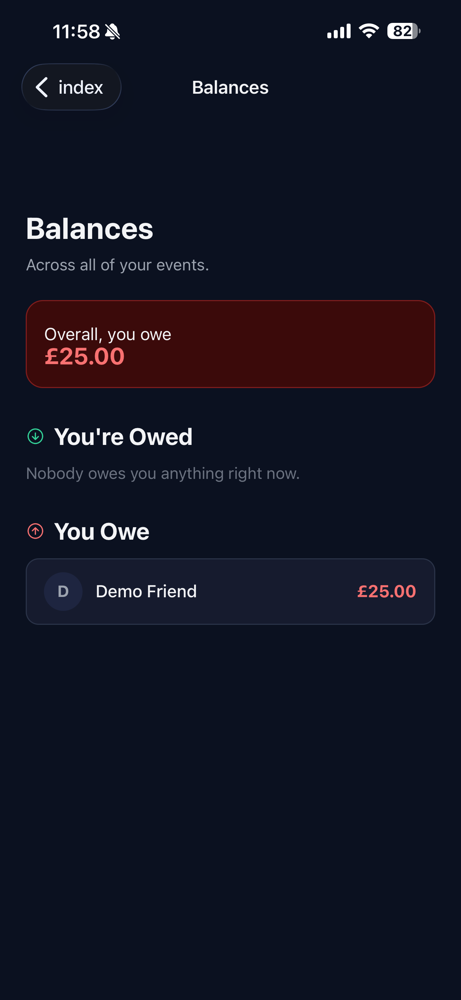
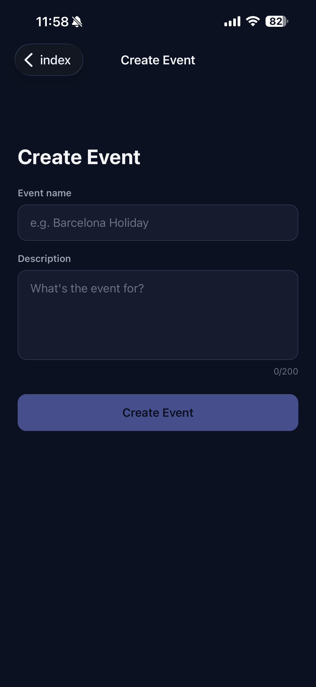
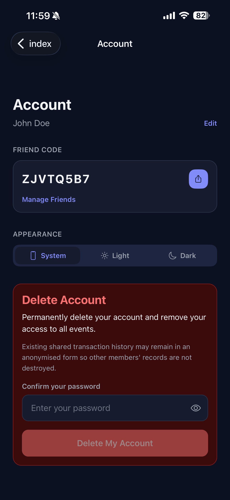

# Squared.

A group expense tracker for splitting shared costs and settling debts with friends. Think "who owes who" for a trip, a house share, or any recurring group expense. Built with React Native (Expo) and Supabase (Postgres, Auth, Edge Functions).

> **Status: private beta.** Squared. is a personal project currently being tested with a small group of friends via TestFlight (iOS) and a direct APK install (Android). It isn't published on the App Store or Google Play, and it isn't meant for general public use yet. Expect rough edges. This repo exists mainly as a portfolio piece and a real-world testbed for the backend security work described below.

## Screenshots

<table>
  <tr>
    <td align="center"><br/>Home (light)</td>
    <td align="center"><br/>Home (dark)</td>
    <td align="center"><br/>Event detail</td>
    <td align="center"><br/>Add transaction</td>
  </tr>
  <tr>
    <td align="center"><br/>Friends</td>
    <td align="center"><br/>Balances</td>
    <td align="center"><br/>Create event</td>
    <td align="center"><br/>Account</td>
  </tr>
</table>

## What makes it different

- **Trust-based, not gate-based.** Most expense-splitting apps require the other party to confirm a debt is real, then confirm again once it's paid. Squared. skips both steps. Recording a transaction makes it outstanding right away, and the debtor marking it paid settles it right away. That matches how it's actually used: a small group of friends who trust each other's word, not strangers who need a paper trail.
- **Unambiguous friend adding.** Adding someone to an event by typing their display name is easy to get wrong: a typo, or the wrong person with a similar name. Squared. adds a friend system built around a unique code instead. Search the exact code, see who it belongs to before you commit, then send a request they accept or decline. Once you're friends, adding them to any event is a single tap.
- **A backend that doesn't trust the client.** Every table has Row Level Security enabled, and every state-changing action goes through a Postgres function that re-derives authorization from the caller's identity instead of trusting anything the app sends. See [About the backend](#about-the-backend) below.

## Features

- **Auth**: email/password sign-up with email confirmation, forgot-password flow, account deletion (soft-deleted so shared history with other members survives).
- **Events**: create a shared event, add registered members by display name or by quick-adding a friend, per-event and cross-event balance views.
- **Friends**: add someone by their unique friend code, with an identity-confirmation step and a request/accept flow (see above).
- **Transactions**: record a debt, the debtor marks it paid when settled. Debtors can edit or cancel a transaction any time before marking it paid.
- **Membership**: leave an event, or (as the creator) remove a member. This is blocked while that person has an unresolved transaction in the event, so debts can't be dodged by disappearing.
- **Dark mode**: system-following by default, with a manual light/dark/system override in Account.

## Tech stack

- **Client**: Expo / React Native, TypeScript, Expo Router (file-based navigation with guarded route groups)
- **Backend**: Supabase (Postgres with Row Level Security), `security definer` RPC functions for every state-changing action, one Edge Function (account deletion, which independently re-verifies the caller's password server-side before doing anything)
- **Testing**: Jest for client-side logic, pgTAP for database/RLS behaviour (see [supabase/README.md](supabase/README.md))

## Platforms

Built for iOS and Android via Expo/EAS. Currently distributed only to beta testers:

- **iOS**: TestFlight (external testing group, invite-only)
- **Android**: direct APK install (EAS internal distribution build)

A web build is technically reachable through `react-native-web` for local development and preview purposes, but the web target isn't polished or intended as a real distribution channel.

## About the backend

Nothing here trusts the client. Every table has Row Level Security enabled, and every mutation goes through a Postgres function that re-derives authorization from `auth.uid()` instead of trusting anything the client sends. For example, a transaction can only ever be inserted as `confirmed` by its actual debtor, and only that same debtor can ever mark it `settled`. The full schema, policies, and RPCs are version-controlled in [supabase/migrations](supabase/migrations), applied incrementally rather than as one dump, with each migration's commit explaining what it changed and why.

The [pgTAP suite](supabase/tests/database/rls_security.test.sql) attacks the database directly: inserting a transaction as an unauthorized status, trying to mark someone else's transaction as paid, trying to delete someone else's event. Each attempt is asserted to correctly fail. It's run against a real local Postgres via Docker, not mocked.

## Getting started

```bash
npm install
npx expo start
```

Then open the result in [Expo Go](https://expo.dev/go), an iOS/Android simulator, or a web browser. You'll need your own Supabase project. Copy `.env.example` to `.env` and fill in your project's URL and anon key, then apply the migrations in [supabase/migrations](supabase/migrations) (see [supabase/README.md](supabase/README.md) for exact steps).

## Testing

Client-side unit tests:

```bash
npm test
```

Database/RLS tests (pgTAP, needs Docker Desktop):

```bash
npx supabase start
npx supabase test db
```

See [supabase/README.md](supabase/README.md) for details on both the migrations and the test suite.

## Project structure

```
app/                   Screens (Expo Router file-based routing)
components/ui/         Shared design-system primitives (Button, Card, TextField, ...)
constants/theme.ts     Color tokens (light/dark), spacing, type scale
context/                AuthContext, EventContext, FriendsContext, ThemeContext
lib/                    Pure business logic (balance calculations) + Supabase client setup
supabase/migrations/   Version-controlled schema, RLS policies, RPC functions
supabase/functions/    Edge Functions
supabase/tests/         pgTAP database tests
```
